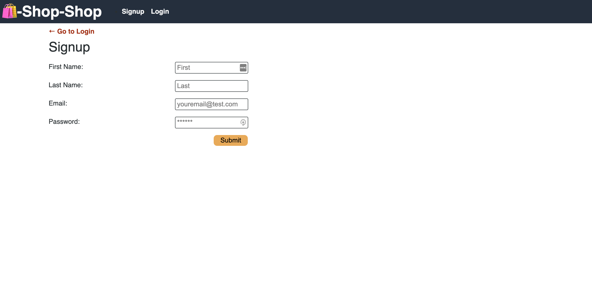

 

# Shop Shop! [Github License](https://img.shields.io/badge/license-MIT-red.svg)
  
## Description
As a senior engineer working on an e-commerce platform.
I want my platform to use Redux to manage global state instead of the Context API
so that my website's state management is taken out of the React ecosystem. I am presented with a application where i can shop for items, adding them to my cart, removing from my cart or even adding duplicates to the cart. Then i am unable to connect to wifi so then my application is able to save my changes of adding or removing to my cart and being able to come back and see my last added item to the cart without having to restart all over again.

  ##  Table of Contents
  * [Installation](#installation)
  * [Usage](#usage)
  * [License](#License)
  * [Contributing](#contributing)
  * [Tests](#Tests)
  * [Questions](#questions)
  
  ## Usage
  In order to run this application, you must fork my repo to your local machine and run it using npm start.
  
  
  # License
  This project is  licensed MIT license.
  
  ## Contributing
  Contributors: Alex Reveles
  ## Test
  The following is needed to run the application: `npm start`.
  ## Questions
  If you have any questions regarding about the application, please contact me.
* [Github](https://github.com/alexreveles)
* [Email](https://alexreveles@yahoo.com) alexreveles@yahoo.com

### https://alex-shop-shop.herokuapp.com/
### https://github.com/alexreveles/shop-shop
### https://github.com/alexreveles

